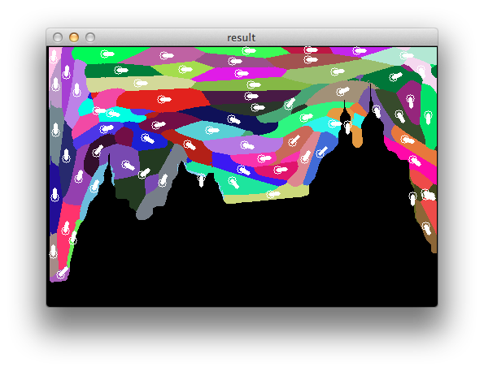

Brush 
======
Details
* Place brush according to the tangent of region boundaries.
* Calculate inner point brush location by broadcasting the tangent
	of boundary points
* Smooth orientations of inner points 
* Get brush location according to the K-Means cluster result
* Fast K-Means implementation with min-batch

Sample results
